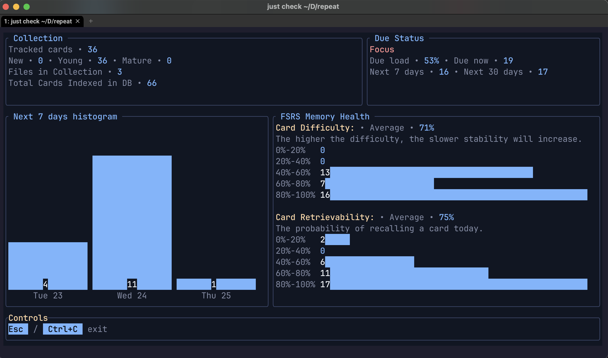

# repeater

<p align="center">
  <a href="https://github.com/shaankhosla/repeater/actions/workflows/ci.yaml">
    
  </a>
  <a href="https://shaankhosla.github.io/repeater/">
    
  </a>
  <a href="https://github.com/shaankhosla/repeater/releases">
    
  </a>
  <a href="LICENSE">
    
  </a>
</p>

`repeater` is a command-line flashcard program that uses [spaced repetition](https://en.wikipedia.org/wiki/Spaced_repetition) to boost your memory retention. It’s like a lightweight, text-based Anki you run in your terminal. Your decks are kept in Markdown, progress is tracked in SQLite, and reviews are scheduled with Free Spaced Repetition Scheduler (FSRS), a state-of-the-art algorithm targeting 90% recall.


> *"Just tested this out and it's amazing! The ability to simply use the same file to take your notes (e.g., in class) and as your flashcards source file is a serious game-changer. I love how minimalist it is, too."*  
> — Reddit user



> [!NOTE]
> You can find the main documentation, including installation guides, at [https://shaankhosla.github.io/repeater/](https://shaankhosla.github.io/repeater/).

## How is this different than Anki?

[Anki](https://apps.ankiweb.net) is a powerful and flexible spaced-repetition system with a mature GUI, mobile apps, and a large plugin ecosystem. If you want a highly customizable study system, Anki is an excellent choice.

`repeater` takes a different approach. Instead of asking you to move your active-recall material into a separate application, your notes themselves are the source of truth. Flashcards live directly inside plain Markdown files, alongside regular notes, and are detected automatically. There is no card editor, no syncing layer, and no separate “collection” to manage.

In practice, this means less flexibility but much less friction. You edit cards the same way you edit notes, using the same tools, and can easily inspect, version, or refactor your material without exports or migrations. The goal is not to replace Anki’s ecosystem, but to offer a simpler, text-first workflow for people who prefer minimalism, the terminal, and plain files over feature depth.

## Features

- **Markdown-first decks**: write basic Q/A + cloze cards in plain `.md` alongside your notes.
- **Media support**: open linked images/audio/video.
- **Anki import**: import your existing Anki decks `.apkg` to Markdown.
- **Stable card identity**: “meaning-only” hashing; formatting tweaks don’t reset progress.
- **Optional LLM helper**: add an OpenAI key once to auto-suggest missing Cloze brackets and optionally rephrase basic questions (see the [docs](https://shaankhosla.github.io/repeater/llm-usage.html)).


## Quick Start

1. Create a deck in Markdown (`cards/neuro.md`):

   ```markdown
   You can put your normal notes here, `repeater` will ignore them.
   Once a "Q:,A:,C:" block is detected, it will automatically
   turn it into a card.

   Q: What does a synaptic vesicle store?
   A: Neurotransmitters awaiting release.

   ---
   Use a separator to mark the end of a card^
   Then feel free to go back to adding regular notes.

   C: Speech is [produced] in [Broca's] area.
   ```


2. Index the cards and start a session:

   ```
   repeater drill cards
   ```


That's it! `repeater` will automatically track progress and schedule reviews.


## Installation

### Install script (Linux & macOS) - Recommended

```
curl --proto '=https' --tlsv1.2 -LsSf https://github.com/shaankhosla/repeater/releases/latest/download/repeater-installer.sh | sh
```

### Homebrew (macOS)

```
brew install shaankhosla/tap/repeater
```

### Windows (PowerShell)

```
irm https://github.com/shaankhosla/repeater/releases/latest/download/repeater-installer.ps1 | iex
```

### npm 

```
npm install @shaankhosla/repeater
```

## Star History

[](https://www.star-history.com/#shaankhosla/repeater&type=date&legend=top-left)
