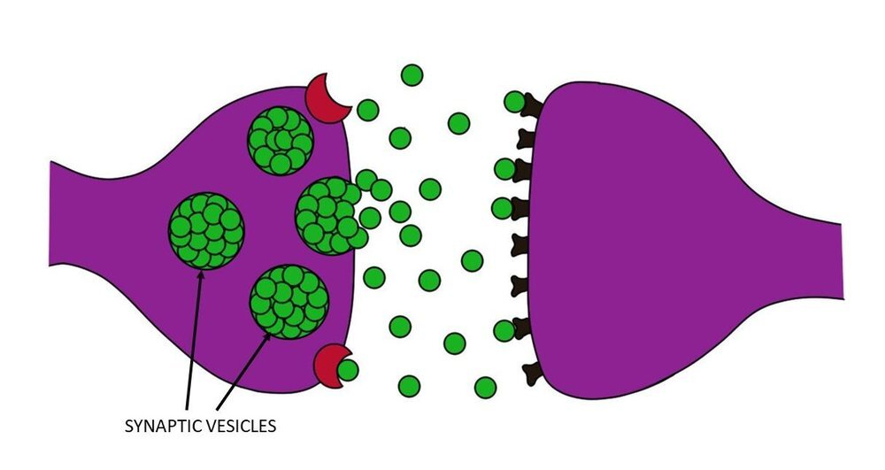

These are going to be my physics notes.

# 2025-12-28 Class

Regular class notes, with embedded flashcards
Q: What does a synaptic vesicle store?

A: Neurotransmitters awaiting release.

Into the synaptic cleft

---
Class notes continue again here

Let's try a Media file

Q: What's in this image:

A: synaptic
